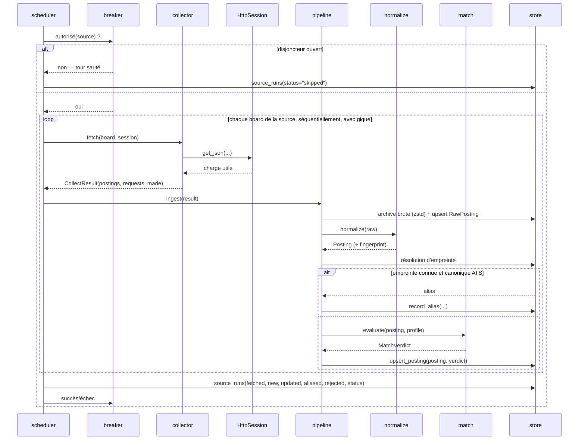
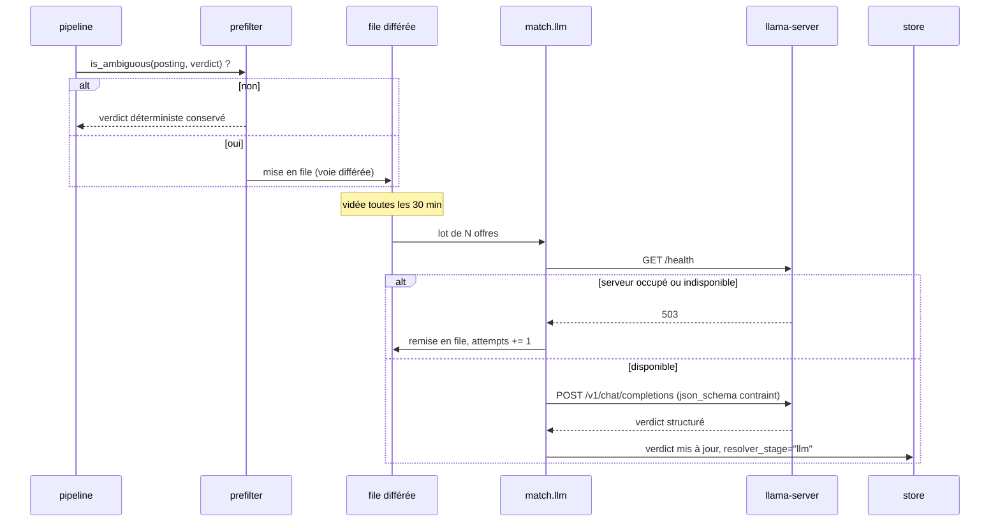
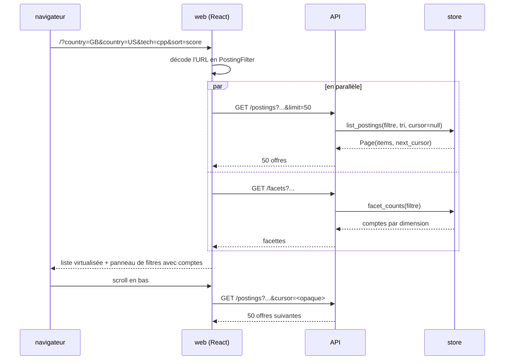
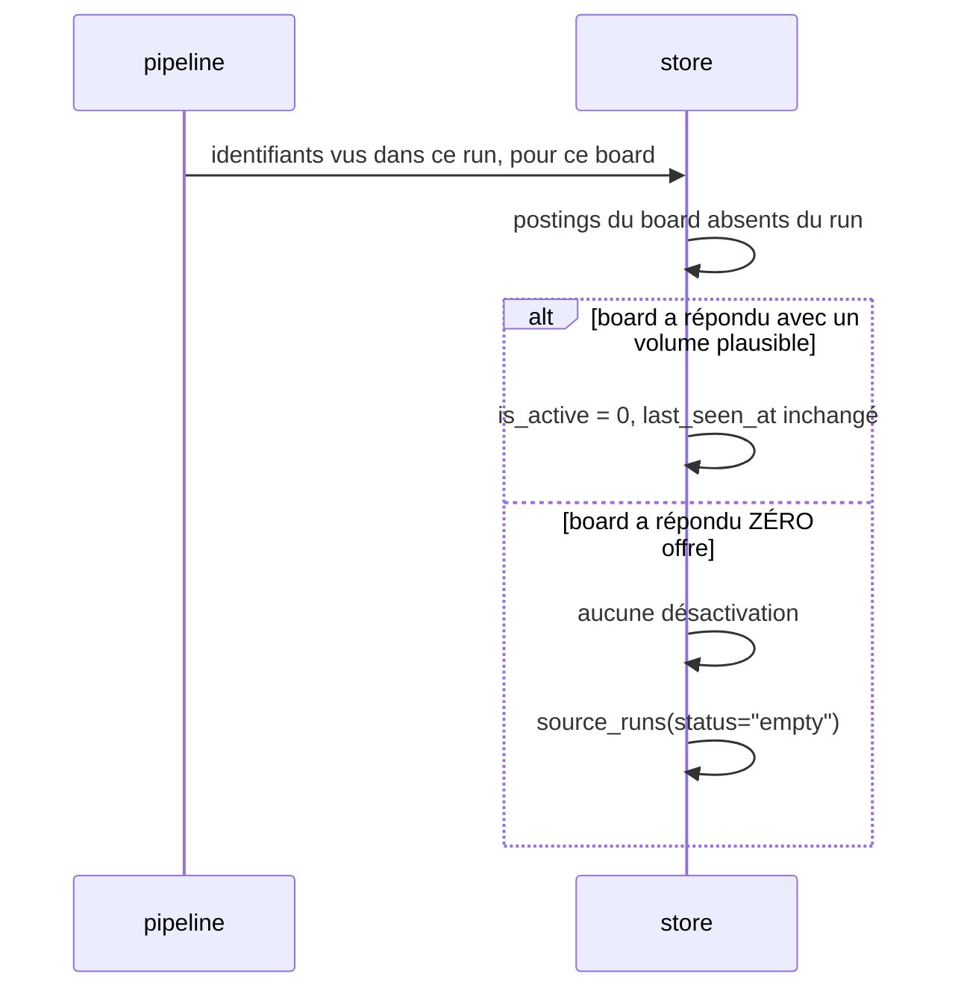
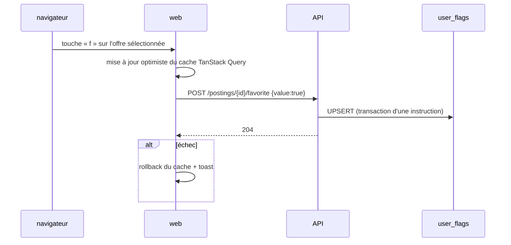

# 05 — Séquences bout-en-bout

> Prérequis : [01-ARCHITECTURE.md](01-ARCHITECTURE.md), [03-INTERFACES.md](03-INTERFACES.md).
> À lire quand vous câblez deux composants.

---

## 1. Un cycle de collecte sur une source

Trois points à ne pas rater :

1. **Le dédoublonnage précède le scoring.** Scorer un alias, c'est brûler du CPU
   et — si le LLM s'en mêle — du GPU, pour une ligne qui ne sera jamais affichée.
2. **L'archive brute est écrite avant la normalisation.** Si le normaliseur
   plante sur une offre exotique, la charge utile est déjà en base et le rejeu
   pourra la reprendre. L'ordre inverse perd précisément les cas intéressants.
3. **`source_runs` est écrit même quand tout va bien et surtout quand il ne
   remonte rien.** C'est la matière première du chien de garde.

---

## 2. Le résidu ambigu part au LLM (WP12)

La voie **urgente** (offre potentiellement `strong` chez une société de rang 1)
tente l'appel immédiatement au lieu de passer par la file. Elle reste rare, par
construction : voir [wp/WP12-match-llm.md](wp/WP12-match-llm.md) §3.

---

## 3. Le front charge un écran

**L'état des filtres vit dans l'URL, pas dans un store React.** Conséquence
directe : un écran est partageable, rechargeable, et le bouton Précédent du
navigateur fonctionne. C'est aussi ce qui rend les bugs de filtre reproductibles
— on colle l'URL dans l'issue.

Les deux appels partent **en parallèle** : les facettes ne bloquent jamais
l'affichage de la liste. Une facette lente dégrade le panneau de filtres, pas le
flux.

---

## 4. Une offre disparaît d'un board

**La branche « zéro offre » est la plus importante du projet.** Un jeton devenu
invalide, un ATS qui change d'URL, un anti-bot qui sert une page vide : tous
produisent une réponse 200 avec zéro offre. Désactiver en masse sur cette base,
c'est vider le flux en silence et croire que le marché s'est arrêté.

Règle : **on ne désactive jamais sur un run à zéro**. On journalise `empty`, on
laisse les offres en place, et le chien de garde alerte si la source reste muette
plus de N cycles.

---

## 5. Un favori est posé

`user_flags` est une table à part (voir [04-DATA-MODEL.md](04-DATA-MODEL.md) §2),
donc une passe de collecte concurrente qui réécrit `postings` **ne peut pas**
écraser un favori. C'est le seul point où l'API écrit, et il est conçu pour ne
jamais entrer en conflit avec l'écrivain principal.
