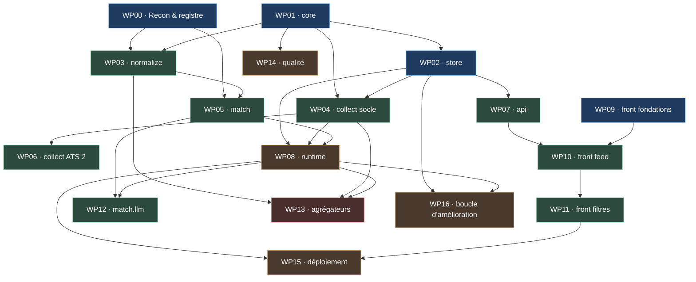

# Blueprint d'implémentation — index

Ce dossier est la **spécification d'implémentation normative** de JobTracker. Il
est écrit pour être lu par des agents de code **sans contexte préalable**, et
découpé pour que **plusieurs sessions codent en parallèle** sans se marcher
dessus.

> **Ce qu'on construit**
>
> **Le produit** = un agent de veille qui collecte les offres d'emploi de toutes
> les sociétés de finance qui recrutent des développeurs quantitatifs, les
> qualifie contre un profil cible, et les sert dans un front web dense où l'on
> scrolle, trie et filtre.
>
> **La cible** = **quant developer junior, 0-2 ans d'expérience, mobile à
> l'international** (Europe, Amérique du Nord, Asie, remote). Voir
> [10-PROFILE-TARGET.md](10-PROFILE-TARGET.md).

En cas de divergence entre ce dossier et un commentaire de code, **ce dossier
fait foi**. En cas de divergence entre ce dossier et la documentation officielle
d'une API tierce, **la documentation officielle fait foi** et le blueprint est
corrigé dans le même commit.

---

## Règle de lecture

**Tout agent lit [00-PRIMER.md](00-PRIMER.md) en premier**, puis
[09-CONVENTIONS.md](09-CONVENTIONS.md), puis **uniquement** les fichiers listés
en tête de son work package. Le reste est du bruit qui consomme du contexte.

---

## Documents transverses

| Fichier | Contenu | Lire si… |
|---|---|---|
| [00-PRIMER.md](00-PRIMER.md) | Contexte, principes, décisions verrouillées, interdits, vocabulaire | **toujours** |
| [01-ARCHITECTURE.md](01-ARCHITECTURE.md) | Packages, frontières, contrats d'import D1→D9, topologie runtime | vous touchez à plusieurs packages |
| [02-REPOSITORY-TREE.md](02-REPOSITORY-TREE.md) | Arborescence complète, responsabilité fichier par fichier | vous créez des fichiers |
| [03-INTERFACES.md](03-INTERFACES.md) | Contrats inter-packages : signatures et DTO, aucun corps | vous implémentez un package |
| [04-DATA-MODEL.md](04-DATA-MODEL.md) | Schéma SQLite, index, FTS5, migrations, rétention | vous touchez la base |
| [05-SEQUENCES.md](05-SEQUENCES.md) | Diagrammes de séquence bout-en-bout | vous câblez deux composants |
| [06-CONFIG.md](06-CONFIG.md) | Référence de configuration : `.env`, `configs/*.yaml` | vous ajoutez un paramètre |
| [07-ERRORS-AND-LOGGING.md](07-ERRORS-AND-LOGGING.md) | Taxonomie d'erreurs, contrat de logging, métriques de run, chien de garde | vous levez ou attrapez une erreur |
| [08-TESTING.md](08-TESTING.md) | Corpus doré, invariants I1→I7, fixtures, marqueurs, CI | **toujours avant de coder** |
| [09-CONVENTIONS.md](09-CONVENTIONS.md) | Conventions de code, unités, nommage, Definition of Done | **toujours avant de coder** |
| [10-PROFILE-TARGET.md](10-PROFILE-TARGET.md) | **La cible** : profil, taxonomie des rôles, grille de scoring, visa, saisonnalité | vous touchez au matcher ou aux filtres |
| [11-SOURCES.md](11-SOURCES.md) | Catalogue des sources : familles d'ATS, endpoints, seed d'entreprises, statut légal | vous écrivez un collecteur |
| [12-WEB-UI.md](12-WEB-UI.md) | Spécification du front : densité, feed, facettes, raccourcis clavier | vous touchez à `web/` |
| [dependencies.md](dependencies.md) | **Matrice de parallélisation** : lots simultanés, fichiers partagés, protocole anti-conflit | vous démarrez un lot |
| [decisions.md](decisions.md) | ADR-001→012 : arbitrages et alternatives rejetées | vous voulez changer une décision |

---

## Work packages

Chaque WP est **autonome** : il rappelle son contexte, ses fichiers à lire, ses
dépendances, ses livrables et ses critères d'acceptation vérifiables par une
commande.

| WP | Titre | Dépend de | Parallélisable avec |
|---|---|---|---|
| [WP00](wp/WP00-recon-registry.md) | Reconnaissance & registre d'entreprises — `companies.yaml`, sondes d'ATS, corpus doré | — | WP01 · WP09 |
| [WP01](wp/WP01-core.md) | `core` — config, logging, erreurs, base, DTO, horloge, géo | — | WP00 · WP09 |
| [WP02](wp/WP02-store.md) | `store` — schéma SQLite, migrations, dépôts, FTS5, facettes | WP01 | WP03 · WP09 |
| [WP03](wp/WP03-normalize.md) | `normalize` — lieu, séniorité, stack, rémunération, visa, empreinte | WP00 · WP01 | WP02 · WP04 |
| [WP04](wp/WP04-collect-core.md) | `collect` — socle HTTP + Greenhouse, Lever, Ashby | WP01 · WP02 | WP03 · WP05 |
| [WP05](wp/WP05-match.md) | `match` — scoring déterministe contre le profil cible | WP00 · WP03 | WP04 · WP06 · WP07 |
| [WP06](wp/WP06-collect-ats2.md) | `collect` — Workday, SmartRecruiters, Workable, Recruitee, pages maison | WP04 | WP05 · WP07 · WP12 |
| [WP07](wp/WP07-api.md) | `api` — FastAPI, filtres, facettes, pagination keyset, OpenAPI | WP02 | WP05 · WP06 |
| [WP08](wp/WP08-runtime.md) | `runtime` — ordonnanceur, disjoncteur, chien de garde inversé, CLI | WP02 · WP04 · WP05 | WP10 |
| [WP09](wp/WP09-web-foundations.md) | Front — fondations, design system, tokens, CI front | — | **tout** |
| [WP10](wp/WP10-web-feed.md) | Front — types générés, TanStack Query, feed virtualisé infini | WP07 · WP09 | WP08 · WP12 |
| [WP11](wp/WP11-web-filters.md) | Front — filtres, facettes, URL partageable, favoris, clavier | WP10 | WP12 · WP13 |
| [WP12](wp/WP12-match-llm.md) | `match.llm` — préfiltre gratuit + LLM local à décodage contraint | WP05 · WP08 | WP06 · WP10 · WP11 |
| [WP13](wp/WP13-aggregators.md) | Agrégateurs fragiles — LinkedIn, Indeed, eFinancialCareers, WTTJ | WP03 · WP04 · WP08 | WP11 · WP12 |
| [WP17](wp/WP17-map.md) | Onglet Carte — pins par ville, liste par pin, mêmes filtres que le feed | WP07, WP10, WP11 | — |
| [WP18](wp/WP18-tracking.md) | Suivi de candidature — statut, note, pastille « nouveau » | WP07, WP10, WP11 | — |
| [WP14](wp/WP14-quality.md) | Qualité & tests — corpus doré, invariants, CI, e2e Playwright | WP01 (amorce) | **tout** |
| [WP15](wp/WP15-deploy.md) | Déploiement auto-hébergé — compose, tunnel Cloudflare, sauvegardes | WP08 · WP11 | WP16 |
| [WP16](wp/WP16-feedback.md) | Boucle d'amélioration — rejeu du normaliseur, rapport, feedback favoris | WP02 · WP08 | WP15 |

---

## Graphe de dépendances

**Lecture rapide.** Trois racines sans prérequis — **WP00** (registre), **WP01**
(noyau), **WP09** (front) — donc **trois sessions peuvent démarrer à la minute
zéro**. Le chemin critique est `WP01 → WP02 → WP04 → WP08`. Le front (WP09 → WP10
→ WP11) est une branche presque indépendante : elle ne rejoint la branche
backend qu'en WP10, et seulement par le contrat OpenAPI. Le détail file par
fichier est dans [dependencies.md](dependencies.md).

---

## Ordre d'exécution recommandé

| Phase | Lots | Livrable vérifiable |
|---|---|---|
| 1 — Racines | WP00, WP01, WP09 | `companies.yaml` avec 150+ sociétés sondées · `just lint` vert sur `core` · une page blanche stylée avec sa CI front |
| 2 — Socle | WP02, WP03, WP04 | `just run-once --source greenhouse` écrit de vraies offres normalisées en base |
| 3 — Sens | WP05, WP07 | `curl /postings?country=GB&seniority=junior` renvoie des offres classées par score |
| 4 — Écran | WP10, WP11 | On scrolle, on filtre, on met en favori. **C'est le premier jour où l'outil sert à quelque chose** |
| 5 — Autonomie | WP06, WP08 | Le système tourne seul, couvre toutes les familles d'ATS, et gueule quand une source se tait |
| 6 — Finesse | WP12, WP16 | Le LLM tranche les cas ambigus ; le rejeu mesure les progrès du normaliseur |
| 7 — Couverture risquée | WP13 | LinkedIn/Indeed, derrière interrupteur, sans que rien d'autre n'en dépende |
| 8 — Industrialisation | WP14 (complet), WP15 | Tests e2e, budgets, déploiement derrière le tunnel |

**Chemin minimal pour un écran qui sert** :
`WP01 → WP02 → WP04 → WP03 → WP05 → WP07 → WP09 → WP10`.
À ce stade : une seule famille d'ATS (Greenhouse), pas de LLM, pas
d'ordonnanceur, lancé à la main. Mais de vraies offres, filtrables, classées.

L'ordre phase 4 avant phase 5 est délibéré. Automatiser une collecte dont on n'a
jamais regardé les résultats, c'est industrialiser un filtre qu'on n'a pas
réglé. Le front sert d'abord à **auditer le normaliseur** : dix minutes de
scroll révèlent plus de bugs de parsing que cent tests unitaires écrits à
l'aveugle.

---

## Ce que ce blueprint ne fait PAS

- Il ne contient **aucune implémentation**. Signatures, schémas, contrats,
  diagrammes, critères d'acceptation. Rien qui compile.
- Il ne fige pas les détails des API tierces. Tout ce qui est marqué
  **`[À CONFIRMER]`** doit être vérifié dans la documentation officielle ou par
  une sonde réelle **au moment de l'implémentation**, jamais deviné. WP00 existe
  pour ça.
- Il ne liste pas les 400 sociétés exhaustivement. [11-SOURCES.md](11-SOURCES.md)
  donne une amorce de ~120 noms et surtout la **méthode** pour étendre le
  registre ; l'étendre est un travail continu, pas un lot.
- Il ne construit **pas** de suivi de candidatures. Décision prise : le site est
  un flux consultable, trié, filtré, avec favoris. Rien de plus. Voir
  [decisions.md](decisions.md) ADR-011.
